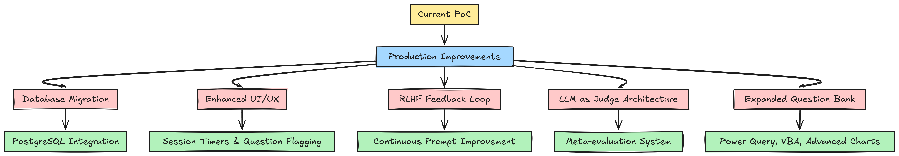

# AI-Powered Excel Mock Interviewer

[](https://excel-ninja.streamlit.app/)
[](https://www.python.org/downloads/)

An AI-powered system that automates Excel skills assessment through intelligent mock interviews, replacing time-consuming manual screening with consistent, scalable evaluations.

---

## Project Mission

**Problem**: Manual Excel screening creates hiring bottlenecks, inconsistent evaluations, and wastes senior analysts' time.

**Solution**: Automated AI interviewer that provides standardized, fair Excel skill assessments at scale.

---

## 🎬 Demo

https://github.com/user-attachments/assets/292e1254-57aa-4ed9-95d6-b16801a9da83

---

## Project Structure

```
ai-excel-interviewer/
├── app.py                              # Main Streamlit application
├── agent.py                            # LangGraph FSM and agent logic
├── prompts.py                          # AI prompts and persona definitions
├── excel_handler.py                    # Data persistence layer
├── questions.json                      # Question bank and curriculum
├── user_credential_and_analysis.xlsx   # User data and results
├── requirements.txt                    # Python dependencies
├── .env                                # Environment variables (API keys)
├── flowchart.png                       # Architecture diagram
└── README.md                           # This file
```
---


## Tech Stack & Architectural Choices

We had full autonomy over the tech stack. The following choices were made to prioritize rapid development, robustness, and cost-effectiveness for this PoC.

| Layer | Technology | Justification |
| :--- | :--- | :--- |
| **LLM** | **Google Gemini 2.0 Flash** | A powerful, multi-modal, and cost-effective solution. The live application is currently powered by a personal API key for demonstration purposes. |
| **Agent Framework** | **LangChain & LangGraph** | **LangChain** provides the essential abstractions for prompt management and tool integration. **LangGraph** is the architectural core, allowing us to model the interview flow.|
| **Frontend** | **Streamlit** | For a PoC. Streamlit's **stateful rerun model** maps well to the request-response cycle of a chat application, enabling the creation of a functional, interactive UI with minimal code. |
| **Data Storage** | **Pandas & OpenPyXL** | A **lightweight, file-based persistence layer** to avoid the setup overhead of a relational or NoSQL database.|

---


## Live Application & Technical Architecture
| Live Application | Technical Architecture |
| :---: | :---: |
| [](https://excel-ninja.streamlit.app/) |  |

--- 

## Usage Guide

### a. Using the Deployed Application

1.  **Navigate** to the application URL: [https://excel-ninja.streamlit.app/](https://excel-ninja.streamlit.app/)
2.  **Select** the "User" login type.
3.  **Enter** an assigned username (e.g., `user1`, `user2`, or `user3`).
4.  **Click** "Start Interview".
5.  Follow the on-screen instructions to complete your interview. At the end, a **Final Performance Report** will be displayed with your overall score.

### b. For the Administrator

1.  **Navigate** to the application URL.
2.  **Select** the "Admin" login type.
3.  **Enter** the credentials:
    * Username: `admin`
    * Password: `admin`
4.  **Click** "Login as Admin".
5.  You will see the **Admin Dashboard**, which is a live, editable view of the user data.
6.  **View Results:** You can see which users have completed the interview (`test_taken` is `True`), their final ratings, and detailed evaluations.
7.  **Configure Interviews:** For any user where `test_taken` is `False`, you can:
    * Change their `interview_type` using the dropdown (Static, Dynamic, Hybrid).
    * Set the `num_questions` for Dynamic or Hybrid interviews.
8.  **Add/Edit Users:** You can directly add new rows to create new user credentials or **edit existing usernames** in the table.
9.  **Save Changes:** After making any changes, click the "Save Changes" button to update the data file. The next time that user logs in, they will receive the interview you configured.

---

## Setup and Installation for Local Use

Follow these steps to run the project locally.

### Prerequisites
- Python 3.9+
- `pip` package installer

### Installation Steps

1.  **Clone the Repository or Download Files:**
    Place all project files (`app.py`, `agent.py`, etc.) into a single directory.

2.  **Create and Activate a Virtual Environment:**
    ```bash
    # For macOS/Linux
    python3 -m venv venv
    source venv/bin/activate

    # For Windows
    python -m venv venv
    venv\Scripts\activate
    ```

3.  **Install Dependencies:**
    ```bash
    pip install -r requirements.txt
    ```

4.  **Configure Environment Variables:**
    Create a file named `.env` in the root of your project directory. Open the file and add your own Google Gemini API key:
    ```env
    # Replace the placeholder with your actual Google Gemini API key
    GOOGLE_API_KEY="YOUR_GEMINI_API_KEY_HERE"
    CHAT_MODEL='gemini-2.0-flash'
    ```

5.  **Run the Application:**
    ```bash
    streamlit run app.py
    ```

    The application will now be running and accessible in your web browser, typically at `http://localhost:8501`.

---

## The Strategy: Solving the "Cold Start" Problem with Three Interview Modes


A key challenge in building an AI evaluation system is the "cold start" problem: how do you ensure quality and relevance without a pre-existing dataset of interview transcripts? Our strategy directly addresses this by implementing three distinct, configurable interview modes. This multi-pronged approach allows us to bootstrap the system effectively and evolve its capabilities over time.

### a. `Static` Mode: The Deterministic Baseline
* **What it is:** A completely deterministic interview that uses a predefined set of questions and expected concepts stored in `questions.json`. The agent's behavior is tightly scripted.
* **Why we built it:** This mode establishes a **deterministic evaluation baseline**, crucial for low-variance roles where core knowledge is paramount. It guarantees consistency and fairness by removing all generative ambiguity, ensuring every candidate is measured against the exact same criteria.

### b. `Dynamic` Mode: The Adaptive, Stochastic Challenger
* **What it is:** A fully generative and adaptive interview where the AI agent creates questions on-the-fly. It leverages the conversational history as context for the next turn, creating a stochastic, context-aware questioning model.
* **Why we built it:** This mode simulates a real, senior-level interview where the interviewer probes deeper based on the candidate's responses. It assesses **fluid intelligence and problem-solving under ambiguity**. It's designed to test for deeper expertise and adaptability, moving beyond rote memorization.

### c. `Hybrid` Mode: Curriculum-Guided Generation
* **What it is:** A sophisticated mode implementing a **curriculum-guided generative approach**. The AI generates new, practical questions inspired by a foundational curriculum (`questions.json`) but does not ask the questions verbatim.
* **Why we built it:** This is the evolutionary sweet spot. It **balances exploratory questioning with syllabus adherence**, preventing the conversational drift that can occur in a purely dynamic mode. It ensures the interview covers key topics while giving the agent the freedom to generate novel scenarios, making it ideal for assessing candidates where both foundational knowledge and practical application are crucial.

This three-mode strategy allows administrators to tailor the assessment to the seniority and requirements of any given role, providing a flexible yet robust solution.


---

## How It Works

The project is structured into modular components, each with a specific responsibility, following separation of concerns.

### `agent.py`: The Brain of the Operation (The FSM)

This file defines the core agentic logic using LangGraph.

* **`AgentState` (TypedDict):** This defines the **schema for the graph's state**, a structured object that is passed between nodes at each computational step, ensuring data consistency throughout the agent's lifecycle.
* **Tools (`@tool`):** These functions define the agent's **action space**. The LLM, operating on a **ReAct (Reasoning and Acting)**-like principle, decides which tool to invoke based on the conversational state and its internal reasoning.
* **Graph Definition (`create_agent_graph`):** This function **compiles the Finite State Machine**. It wires together the nodes (`agent_node` as the router/brain, `tool_node` as the action executor) and the conditional edges that dictate the flow of the interview, creating a predictable yet dynamic conversational agent.

### `prompts.py`: Shaping the AI's Persona and Logic

This file is the core of the agent's **behavioral programming**, using prompt engineering to constrain the LLM.

* **System Prompts (`STATIC_SYSTEM_PROMPT`, etc.):** These act as **meta-instructions** or **zero-shot role-playing prompts**. They define the agent's persona ("Excel Ninja"), its operational rules (no hints), and the deterministic sequence of tool calls it must follow.
* **Evaluation Prompts (`STATIC_EVALUATION_PROMPT_TEMPLATE`, etc.):** These are engineered for **structured data extraction**. They compel the LLM to provide not only a qualitative evaluation but also a clean, machine-readable "Verdict:", which can be programmatically parsed without complex regex, ensuring data integrity.
* **`FINAL_JUDGING_PROMPT_TEMPLATE`:** This prompt invokes an "AI Hiring Manager" persona, tasked with a final, holistic assessment based on the entire interview transcript, culminating in a quantitative rating.

### `excel_handler.py`: The Simple Database Layer

This module implements a simple **Data Access Object (DAO)** pattern for the `user_credential_and_analysis.xlsx` file, abstracting away the file I/O logic.

* `initialize_excel_file()`: Bootstraps the data store, creating the file with a predefined schema and default user data.
* `validate_user()`: Handles user authentication and authorization by checking credentials and interview status.
* `save_interview_results()`: Persists the session's outcome, writing the final rating and detailed feedback report to the data store.
* `get_all_results()`: Retrieves all records for display and manipulation in the admin dashboard.

### `app.py`: The User & Admin Interface

This is the main Streamlit application file that orchestrates the user experience.

* **Login Management:** Implements role-based access control (RBAC) for "User" and "Admin" roles.
* **User View (`show_interview_page`):** Manages the user-facing interview session. It leverages `st.session_state` to **preserve the LangGraph thread state across Streamlit's script reruns**, maintaining a continuous conversation.
* **Admin View (`show_admin_dashboard`):** Provides a CRUD-like interface for administrators. The use of `st.data_editor` allows for direct manipulation of the underlying data, enabling real-time configuration of user interview settings.

---

## Future Improvements & Scalability



This PoC provides a robust foundation. A production-grade system would require the following enhancements:

1.  **Database Migration:** Migrate from Excel to a relational database (e.g., PostgreSQL) to ensure **transactional integrity, concurrent access, and scalability**.
2.  **Enhanced Frontend:** Implement features like a session timer and add the ability for users to flag questions they found unclear.
3.  **Feedback Loop for Continuous Improvement (RLHF):** The admin dashboard could be expanded to allow admins to rate the quality of the AI's questions and evaluations. This feedback would serve as a **reward signal** for implementing a high-level **Reinforcement Learning from Human Feedback (RLHF)** loop, enabling continuous fine-tuning of the prompt templates.
4.  **LLM as a Judge:** A significant future step would be to implement an "LLM as a Judge" architecture. This involves using a separate, powerful LLM (e.g., GPT-4, Claude 3 Opus) to evaluate the quality of the primary interviewer agent's questions, evaluations, and overall conversational behavior. This meta-evaluation could assess factors like fairness, clarity, and relevance, providing structured feedback to automatically improve the interviewer agent. This was not implemented due to the constraint of using a single, free-tier API key, but it represents a clear path to a more autonomous, self-improving system.
5.  **Expanded Question Bank & Curriculum:** The `questions.json` curriculum could be significantly expanded and structured by topic and difficulty, covering a wider range of Excel capabilities like Power Query, advanced charting, and VBA macros.


## Contact

Mohit - [GitHub Profile](https://github.com/mohit09082002)

Project Link: [https://github.com/mohit09082002/ai-excel-interviewer](https://github.com/mohit09082002/ai-excel-interviewer)

---